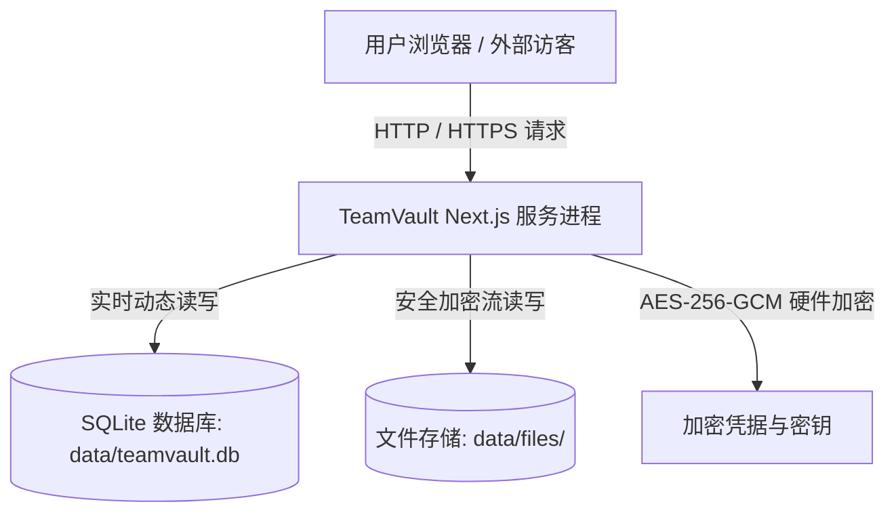

# TeamVault Linux 服务器部署、数据持久化与自动更新指南

本文档详细说明 TeamVault 在 Linux 服务器上的**数据存储交互原理**、**零数据丢失热更新方案**以及**从 GitHub 发布到生产环境的多种部署流程**。

---

## 目录
1. [数据存储与交互架构（为什么日常使用无需重启）](#1-数据存储与交互架构为什么日常使用无需重启)
2. [数据持久化与升级隔离原则](#2-数据持久化与升级隔离原则)
3. [方案一：Docker Compose 容器化一键部署（强烈推荐）](#3-方案一docker-compose-容器化一键部署强烈推荐)
4. [方案二：Linux 原生 Node.js + PM2 零停机部署](#4-方案二linux-原生-nodejs--pm2-零停机部署)
5. [方案三：GitHub Actions CI/CD 自动部署（Push 即上线）](#5-方案三github-actions-cicd-自动部署push-即上线)
6. [方案四：离线独立包（Standalone）快速部署](#6-方案四离线独立包standalone快速部署)
7. [数据库自动备份与灾难恢复](#7-数据库自动备份与灾难恢复)

---

## 1. 数据存储与交互架构（为什么日常使用无需重启）

在生产环境中，**业务数据的创建、修改与删除完全不需要重启服务器**：



- **数据库层**：采用 SQLite WAL (Write-Ahead Logging) 模式，多连接高并发读写，毫秒级即时写入；
- **文件与资料**：直接流式写入 `./data/files/`，支持图片、PDF、PPT、视频等任意格式；
- **凭据与密码**：写入时经过 `AES-256-GCM` 算法实时加密密文入库，读取时实时动态解密。

> **提示**：只有在**修改了系统底层源代码**或**发布了软件新版本**时，才需要执行更新重启。

---

## 2. 数据持久化与升级隔离原则

为确保软件更新时**数据 100% 安全不丢失**，TeamVault 严格遵守**程序与数据解耦架构**：

- **程序代码区**（更新时会被替换）：`.next/`、`node_modules/`、`public/` 等
- **持久化数据区**（更新时绝对不触碰）：
  - `data/teamvault.db`：所有用户、模块、凭据密文、分享链接、审计日志
  - `data/files/`：上传的各类原始文件
  - `data/previews/` & `data/thumbnails/`：生成的在线预览缓存
  - `data/backups/`：自动备份快照

---

## 3. 方案一：Docker Compose 容器化一键部署（强烈推荐）

使用 Docker 部署是 Linux 上最干净、最稳定的方案，所有运行环境完全隔离。

### 3.1 首次部署步骤
在 Linux 服务器上执行：

```bash
# 1. 克隆代码仓库到指定目录（如 /opt/teamvault）
git clone https://github.com/flycodeu/TeamVault.git /opt/teamvault
cd /opt/teamvault

# 2. 配置环境变量
cp .env.example .env
# 编辑 .env 文件，填入安全主密钥与管理员初始密码
nano .env

# 3. 一键构建并后台启动
docker compose up -d --build
```

服务将自动运行于：`http://your-server-ip:3030`。

### 3.2 后续发布新版本（一键更新命令）
当在 GitHub 发布了新版本代码后，只需在服务器执行：

```bash
cd /opt/teamvault
chmod +x scripts/deploy.sh
./scripts/deploy.sh
```

**该脚本会自动**：
1. 自动备份当前 SQLite 数据库到 `data/backups/`；
2. 拉取 GitHub 最新代码；
3. 重新构建容器镜像并无缝平滑替换运行中容器；
4. 保留所有旧数据与已上传文件。

---

## 4. 方案二：Linux 原生 Node.js + PM2 零停机部署

如果服务器上不使用 Docker，可以使用 Node.js (v20+) + PM2 进程管理器进行部署。

### 4.1 首次配置与启动
```bash
cd /opt/teamvault
npm install -g pm2

# 安装生产依赖并编译
npm ci
npm run build

# 使用 PM2 启动服务（开机自启）
pm2 start ecosystem.config.cjs
pm2 save
pm2 startup
```

### 4.2 后续平滑热重载（零停机）
```bash
./scripts/deploy.sh
```
或者手动执行：
```bash
git pull origin main
npm ci
npm run build
pm2 reload teamvault --update-env
```

---

## 5. 方案三：GitHub Actions CI/CD 自动部署（Push 即上线）

项目中已配置好 `.github/workflows/deploy.yml`。

在 GitHub 仓库的 **Settings -> Secrets and variables -> Actions** 中配置：
- `SERVER_HOST`: 您的 Linux 服务器公网 IP 或域名
- `SERVER_USER`: SSH 登录用户名（如 `root` 或 `ubuntu`）
- `SERVER_SSH_KEY`: 私钥内容（用于免密 SSH 登录）
- `SERVER_APP_DIR`: 服务器上的项目路径（如 `/opt/teamvault`）

配置完成后，**每次将代码 push 到 `main` 分支或在 GitHub 发布 Release，GitHub 将自动完成编译检查并通过 SSH 在服务器上执行一键无缝部署**！

---

## 6. 方案四：离线独立包（Standalone）快速部署

TeamVault 开启了 Next.js `standalone` 模式。构建出的产物只有极小的体积，不需要在服务器上安装开发依赖：

```bash
# 本地打包
npm run build

# 打包后的独立运行目录位于：.next/standalone
# 仅需将 .next/standalone 拷贝至服务器任意目录
node server.js
```

---

## 7. 数据库自动备份与灾难恢复

### 7.1 自动快照机制
每次运行 `./scripts/deploy.sh` 脚本前，系统都会在 `data/backups/` 目录下生成一个带时间戳的完整数据库快照，例如：
`data/backups/teamvault-20260814_140000.db`

### 7.2 手动全量数据备份
如需将整套数据（含文件与数据库）打包备份：
```bash
tar -czvf teamvault-data-backup-$(date +%Y%m%d).tar.gz ./data
```

### 7.3 数据恢复
如需恢复至某份备份：
```bash
# 停止服务
docker compose stop || pm2 stop teamvault

# 覆盖数据库文件
cp data/backups/teamvault-20260814_140000.db data/teamvault.db

# 重新启动服务
docker compose start || pm2 start teamvault
```
