<div align="center">


# TeamVault

**轻量级小组资源管理平台** — 网站入口 · 账号凭据 · 文档文件，一站式统一管理

[](https://nextjs.org)
[](https://react.dev)
[](https://www.typescriptlang.org)
[](https://www.sqlite.org)
[](https://orm.drizzle.team)
[](https://ui.shadcn.com)
[](https://www.docker.com)

**单体 · 轻量 · 美观 · 安全 · 数据易迁移 · 后期可扩展**

</div>

TeamVault 面向小组内部场景，把散落在各处的东西收拢进「资源卡片」：**系统入口（URL / IP / 端口）、账号与密钥（密码 / API Key / Token / SSH）、文档文件（PDF / Office / 图片）**，并配合小组授权、外部分享与全程审计，一个应用即可替代「导航书签 + 密码表 + 网盘」的组合。

> 设计理念：一个仓库、一个进程、一个 SQLite、一个 `data` 目录。V1 明确不引入 Redis、MinIO、消息队列与独立后端。

---

## 目录

- [核心特性](#-核心特性)
- [界面预览](#-界面预览)
- [系统架构](#-系统架构)
- [安全设计](#-安全设计)
- [技术栈](#-技术栈)
- [快速开始](#-快速开始)
- [项目结构](#-项目结构)
- [开发进度](#-开发进度)
- [相关文档](#-相关文档)

---

## ✨ 核心特性

| | 特性 | 说明 |
|---|---|---|
| 🗂️ | **统一资源库** | 网站 / 服务器 / 数据库 / API / 文档等类型以卡片聚合，URL、IP、端口、标签一键可达 |
| 🔐 | **凭据保险箱** | 一资源多凭据，支持密码、API Key、Token、SSH、数据库连接等 8 种类型，AES-256-GCM 加密存储 |
| 📄 | **在线预览** | PDF / PPTX / DOCX / XLSX / CSV / 图片 / 视频 / 音频 / 文本 / ZIP 浏览器端只读预览，无需安装 Office |
| 🔗 | **外部分享** | 临时分享链接：有效期、访问密码、访问次数、是否允许下载，随时撤销；凭据永不进入匿名分享 |
| 👥 | **小组与权限** | 用户 / 小组两级授权，`VIEW` / `VIEW_SECRET` / `VIEW_FILE` / `DOWNLOAD` / `EDIT` / `SHARE` 细粒度控制 |
| 📋 | **全程审计** | 登录、查看 / 复制密码、上传 / 下载 / 删除文件等关键操作全部留痕，可按用户与操作检索 |
| 💾 | **备份迁移** | 一键导出完整备份（数据库 + 文件 + 清单），支持跨环境导入恢复，数据不被锁死 |
| 🌙 | **现代化 UI** | 参考 Vercel / Linear 的设计语言：浅色 / 深色主题、大留白、轻边框、统一图标、响应式布局 |

## 🖼️ 界面预览

| 登录页 | 工作台概览（浅色） |
|---|---|
| 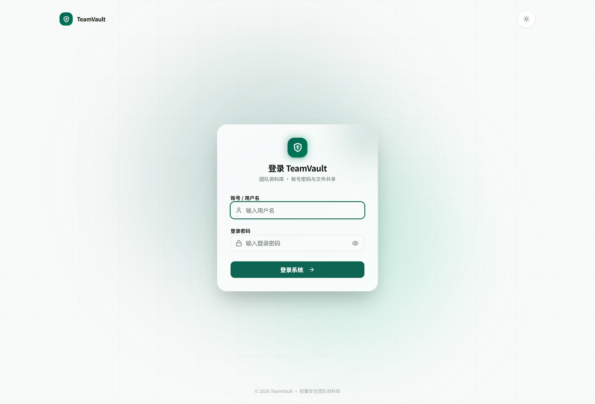 | 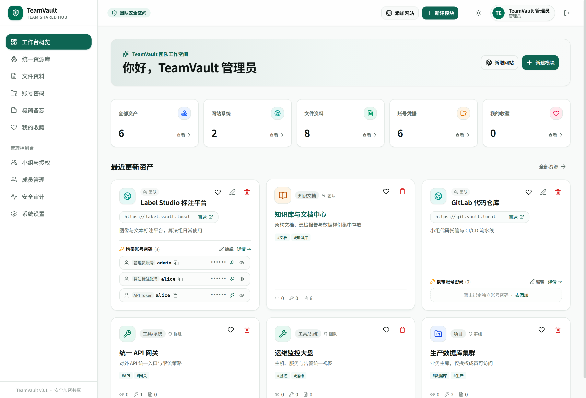 |

| 工作台概览（深色） | 统一资源库 |
|---|---|
| 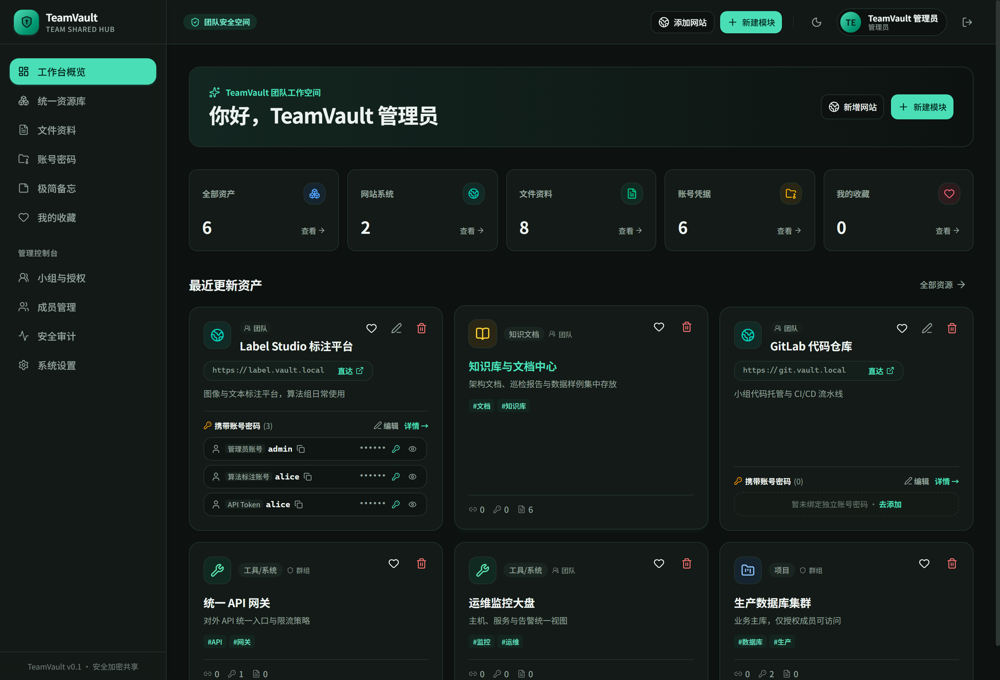 | 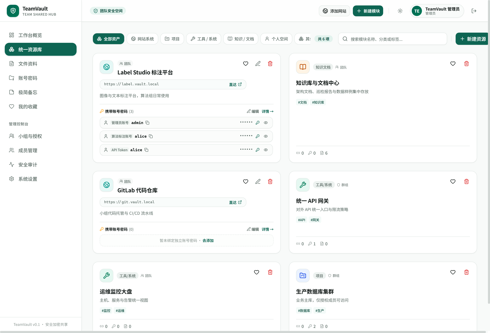 |

| 资源详情（凭据 + 文件） | PDF 在线预览 |
|---|---|
| 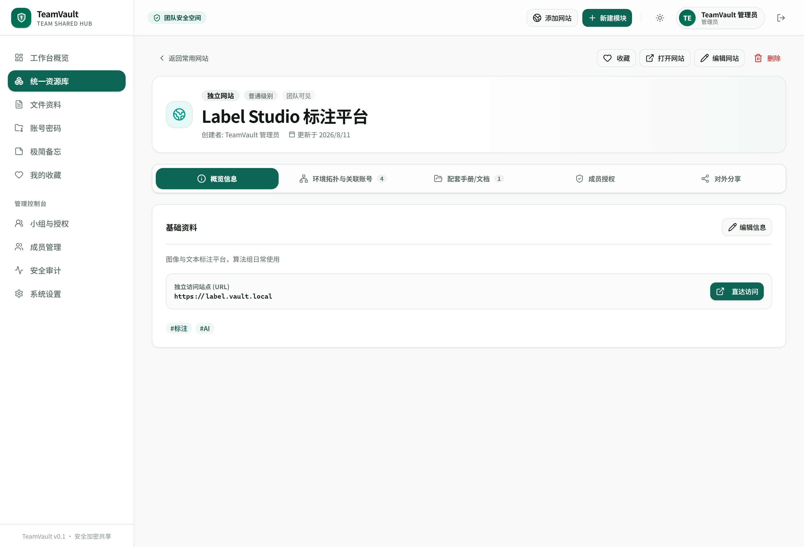 | 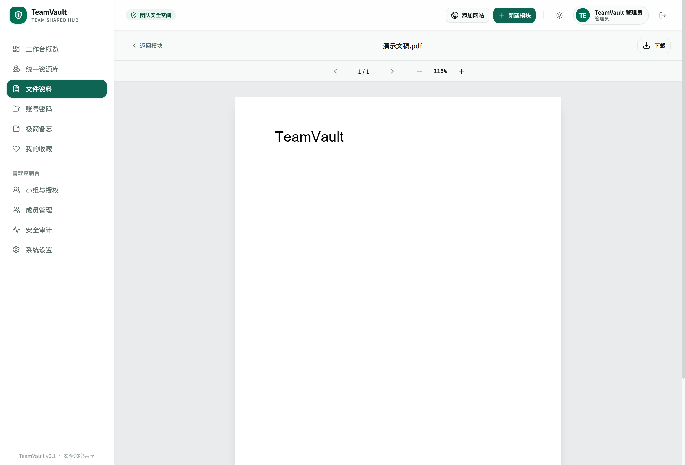 |

| Markdown 预览 | 账号密码 | 文件资料 |
|---|---|---|
| 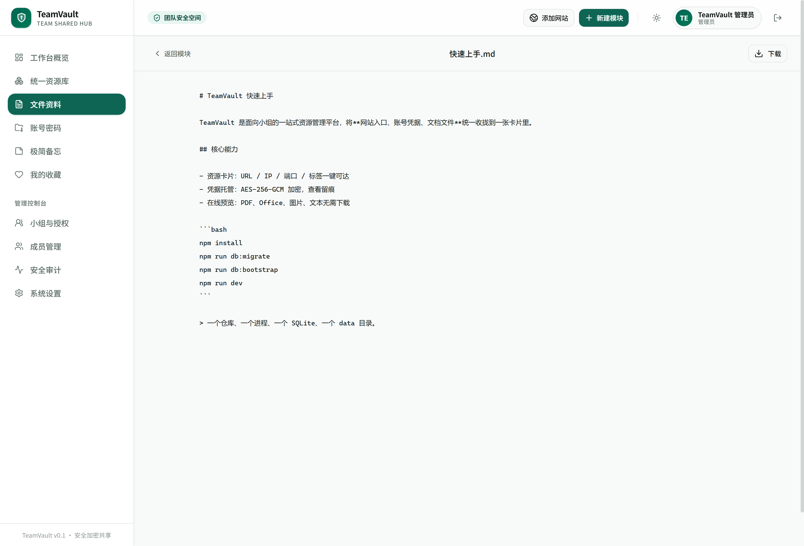 | 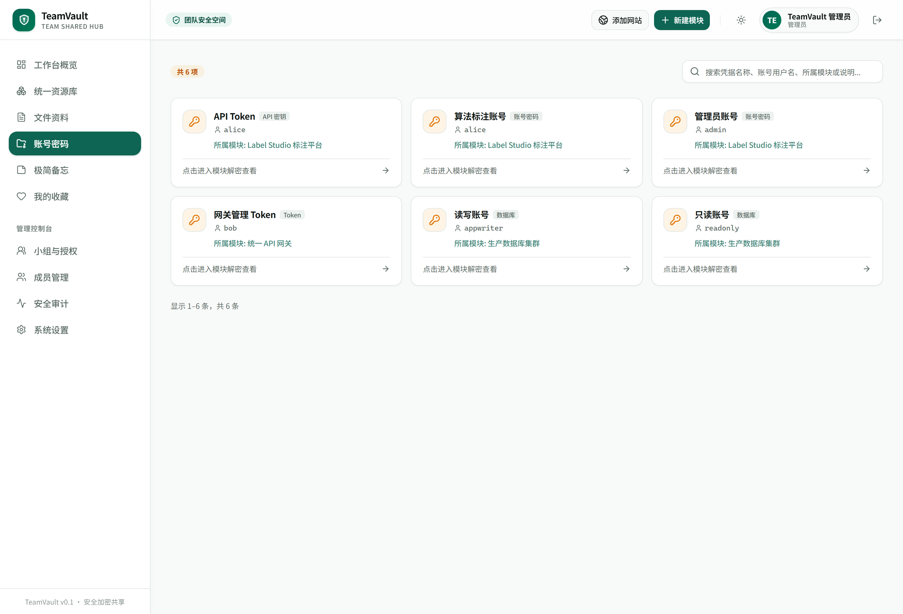 | 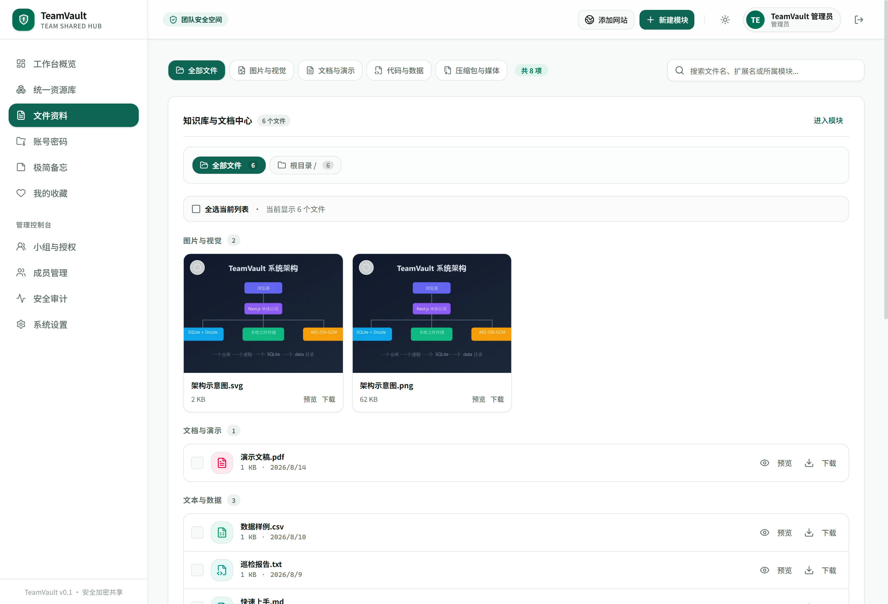 |

| 极简备忘 | 安全审计 | 系统设置 |
|---|---|---|
| 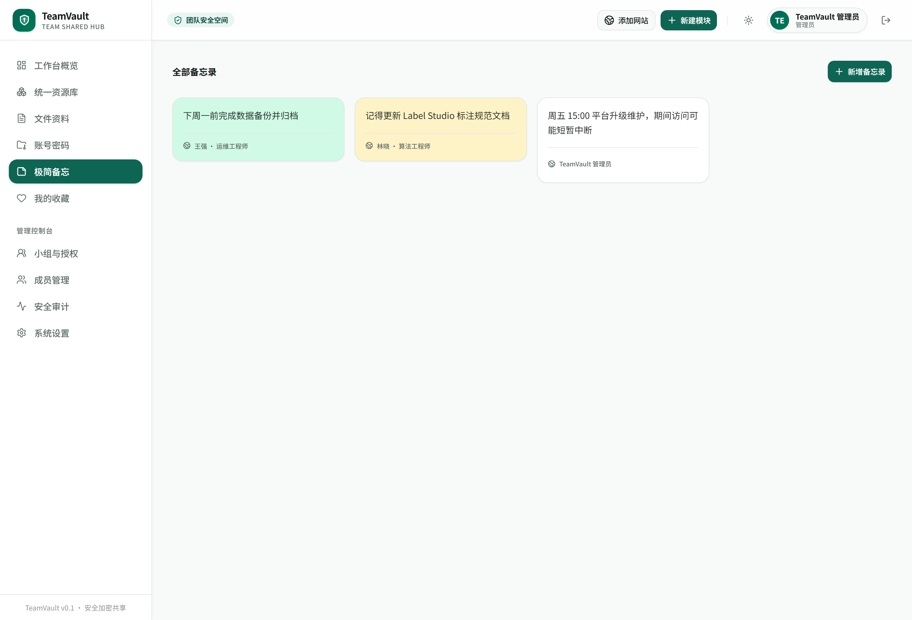 | 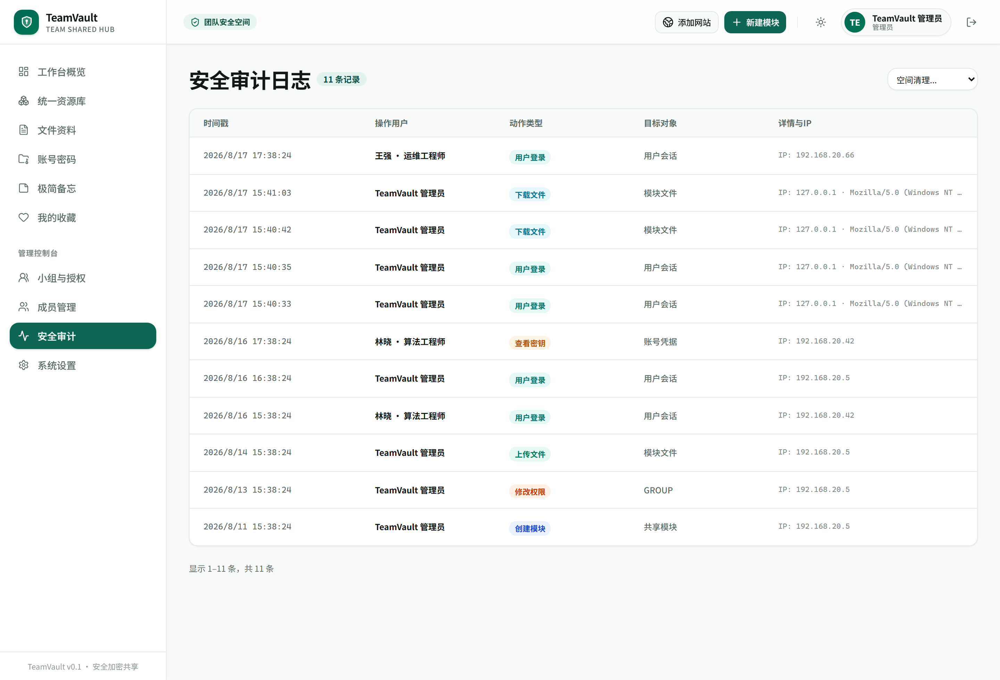 | 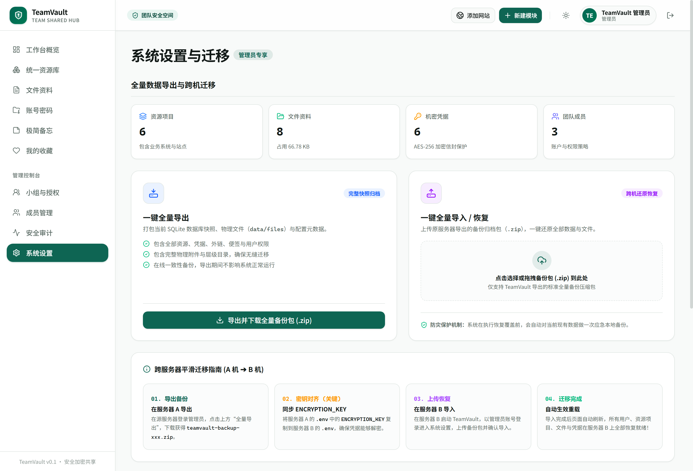 |

> 在线预览采用浏览器端只读方案，不依赖 LibreOffice 与在线编辑服务；超限文件（如 PPTX > 50MB）会明确降级为下载。视频优先支持 MP4（H.264/AAC）与 WebM（VP8/VP9/Opus），对 MOV 等兼容性不确定的封装会给出提示，不兼容的编码则明确引导下载后用 VLC / PotPlayer 等本地播放器查看。

## 🏗️ 系统架构

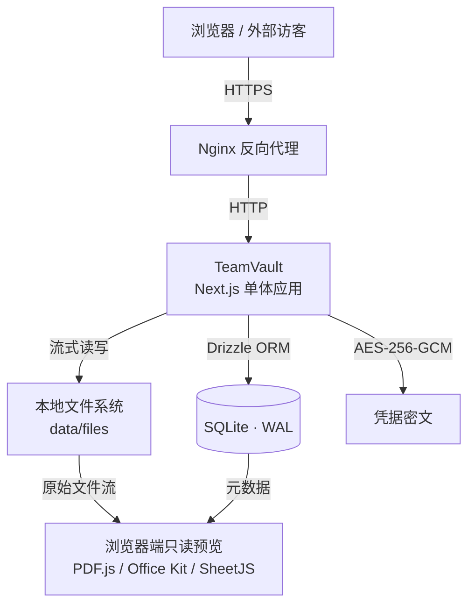

**数据流约定**

- 页面查询：`Server Component → Drizzle → SQLite`；数据修改：`Server Action → 权限校验 → Drizzle`
- 文件接口（上传 / 下载 / 预览）走 Route Handler，支持 HTTP Range，登录态与分享链接复用同一套预览组件
- 数据目录：`data/teamvault.db`（业务数据）+ `data/files/`（原始文件）+ `data/thumbnails/`（缩略图），程序与数据解耦，升级不丢数据

## 🛡️ 安全设计

| 项目 | 方案 |
|---|---|
| 用户密码 | Argon2id 不可逆哈希 |
| 凭据存储 | AES-256-GCM 加密，`TEAMVAULT_MASTER_KEY` 仅存环境变量，绝不入库 |
| 会话 | 服务端 Session + HttpOnly Cookie + SameSite + CSRF 同源校验 |
| 分享链接 | 256-bit 随机 Token，数据库仅存 SHA-256 摘要，支持密码 / 有效期 / 次数限制 |
| 文件上传 | MIME + 扩展名双重校验、UUID 化存储、SHA-256 去重、下载必须鉴权 |
| 审计 | 密码查看 / 复制、文件下载等敏感操作强制留痕，日志不落 Secret |
| 防护 | 登录失败限速、软删除 + 回收站、管理员可强制用户下线 |

## 🧰 技术栈

| 层 | 技术 |
|---|---|
| Web | [Next.js 16](https://nextjs.org) (App Router) · React 19 · TypeScript |
| UI | [shadcn/ui](https://ui.shadcn.com) · Tailwind CSS 4 · Lucide 图标 · 深浅双主题 |
| 数据 | SQLite (WAL) · [Drizzle ORM](https://orm.drizzle.team) · 版本化迁移 |
| 认证 | 服务端 Session · Argon2id · 登录限速 |
| 加密 | Node `crypto` AES-256-GCM |
| 预览 | PDF.js · @office-kit/pptx · docx-preview · SheetJS · Sharp（缩略图） |
| 部署 | Docker · Nginx · PM2 · GitHub Actions CI/CD |

## 🚀 快速开始

### 本地开发

要求 **Node.js 22**：

```bash
npm install
npm run db:migrate   # 执行数据库迁移
npm run db:bootstrap # 首次初始化管理员（用户表为空时可用）
npm run dev          # http://localhost:3030
```

### Docker 部署

```bash
cp .env.example .env  # 按环境配置 TEAMVAULT_MASTER_KEY / TEAMVAULT_ADMIN_*
docker compose up -d --build
```

容器入口会在启动时自动执行迁移与管理员引导（幂等）。生产环境只执行已提交的迁移，不使用 `db push`。

### 环境变量

- `TEAMVAULT_MASTER_KEY`：32 字节随机值的 Base64，用于凭据加解密，**不能写入数据库或提交到仓库**
- `TEAMVAULT_ADMIN_USERNAME` / `TEAMVAULT_ADMIN_PASSWORD`：仅首次初始化管理员；已有用户时不覆盖
- `TEAMVAULT_SESSION_DAYS`：会话有效期（默认 14 天）

### 验证

```bash
npm run typecheck
npm run lint
npm run build   # 同时产出 .next/standalone 独立部署包
```

## 📁 项目结构

```text
teamvault/
├── app/
│   ├── (auth)/login/          # 登录
│   ├── (dashboard)/           # 工作台：资源/文件/凭据/备忘/收藏
│   │   ├── resources/         #   统一资源库（列表/新建/详情/编辑）
│   │   ├── files/[id]/preview #   文件在线预览
│   │   ├── credentials/       #   账号密码
│   │   ├── groups/ users/     #   小组与成员管理
│   │   ├── audit/             #   安全审计
│   │   └── settings/          #   系统设置与备份迁移
│   ├── s/[token]/             # 外部分享页（无登录）
│   └── api/                   # 上传/下载/预览/缩略图等 Route Handler
├── components/                # ui / layout / resource / credential / file ...
├── lib/                       # auth / db / crypto / permission / storage / share / audit
├── drizzle/                   # 版本化迁移与快照
├── scripts/                   # 迁移 / 引导 / 备份 / 部署脚本
├── data/                      # 运行数据（不入库）：db + files + previews + thumbnails
├── nginx/                     # 反向代理配置
├── Dockerfile · docker-compose.yml · ecosystem.config.cjs
└── package.json
```

## 📊 开发进度

```text
M0  项目初始化          ✅    M1  登录与布局        ✅
M2  资源管理            ✅    M3  凭据管理          ✅
M4  文件管理            ✅    M5  在线预览          ✅
M6  用户与小组          ✅    M7  权限体系          ✅
M8  外部分享            ✅    M9  操作审计          ✅
M10 备份迁移            ✅    M11 安全加固与细节    🚧
```

核心业务链路已全部跑通：创建用户与小组 → 新增资源（URL / IP / 凭据 / 文件）→ 授权访问 → 在线预览 → 外部分享 → 审计留痕 → 完整备份。

## 📚 相关文档

- [部署指南 DEPLOYMENT.md](DEPLOYMENT.md) — Docker / PM2 / GitHub Actions 四种部署方案与数据恢复
- [界面与交互](app/) — 直接阅读代码中的页面与组件

---

<div align="center">

**TeamVault** · 为小组打造的轻量级资源管理平台

</div>
